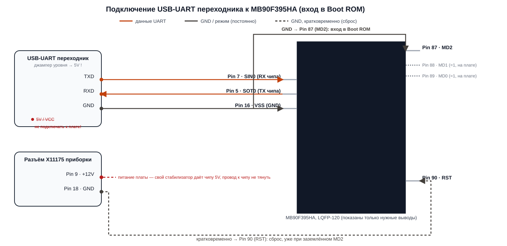

# Схема подключения к процессору Fujitsu MB90F395HA (E9X BASIS / HKOML2 / DKOML2) через UART

Документ описывает распиновку, режим программирования встроенного Bootloader (Flash Programming Mode) и схему подключения переходника USB-UART (FTDI / CH340 / CP2102) для чтения и записи Flash/EEPROM процессора Fujitsu серии F2MC-16LX MB90390.

Применяется ко всем приборным панелям BMW E8x / E9x на базе данного чипа:
- **E9X BASIS (Low)** (например, ZB NR: 9242338-01, HW 27, SW B3.41.81)
- **E9X HIGH (HKOML2)**
- **PL2-DKG (DKOML2)**

> [!IMPORTANT]
> **Номера выводов в этой редакции документа сверены с официальным
> даташитом** Fujitsu/Spansion **DS07-13723-8Ea «MB90390 Series»**, раздел
> «PIN ASSIGNMENTS» → таблица **«MB90394HA/MB90F394HA/MB90F395HA»**
> (TOP VIEW, LQFP-120, корпус FPT-120P-M21) — именно для нашего чипа, а не
> для соседнего `MB90V390HB` из той же серии, у которого распиновка другая.
> Предыдущая редакция этого документа содержала **неверные номера выводов**
> (ошибочно Pin 11/12/19-22/23-24) — если вы паяли по ней, перепроверьте
> монтаж по таблице ниже, прежде чем подавать питание.

> [!CAUTION]
> **2026-10-11: критическая правка — выводы UART для входа в Boot ROM
> другие.** Вся предыдущая редакция этого параграфа (ниже) называла
> `SIN0`/`SOT0` (Pin 7 / Pin 5) выводами для связи с загрузчиком прошивки.
> Это **оказалось неверно** — проверено вживую, часами безрезультатной
> попытки синхронизации на полностью корректно (многократно перепроверено
> мультиметром и иглой) распаянной плате: питание, MD0/MD1/MD2, RST, GND —
> всё верно, ответа от процессора не было никогда, ни на одной скорости, ни
> на одном байте синхронизации.
>
> Причина: `SIN0`/`SOT0` — это пины **общего назначения UART0**, описанные
> в общем hardware-даташите MB90390. Но **именно вход в Boot ROM этого
> конкретного чипа слушает другой, выделенный канал UART** — это
> документировано только в отдельной спецификации
> **Fujitsu «FLASH MCU Programmer for F2MC-16LX» Specifications** (таблица
> «Serial data I/O pins and start pins for each type of microcontroller»),
> а не в общем hardware-даташите, поэтому предыдущая редакция документа
> этого не учла. Для строки `MB90F395H` в этой таблице:
>
> | | Вывод | № ноги LQFP-120 (из датащита MB90390) |
> |---|---|:---:|
> | Serial Data **Input** (Boot ROM RX) | `PB4/SIN4` | **Pin 52** |
> | Serial Data **Output** (Boot ROM TX) | `PB6/SOT4` | **Pin 54** |
> | Starting pin `P00` | = **H** (+5V) | **Pin 93** |
> | Starting pin `P01` | = **L** (GND) | **Pin 94** |
>
> Маркировка на корпусе чипа — `MB90F395HA`, что соответствует строке
> `MB90F395H` таблицы (с опорным генератором 5/10/20 МГц, отсюда `P00=H`) —
> не строке `MB90F394/H` (опорный 4/8/16 МГц, там было бы `P00=L`).
> **Подтверждено независимо двумя источниками**: той же спецификацией
> Fujitsu и скриншотом базы распиновок инструмента **iProg** (строка
> `MB90394HA/MB90F394H/MB90F394HA/MB90F395H/MB90F395HA`, явно показывает
> `SIN4`→52, `SOT4`→54 в том же месте корпуса).
>
> `MD0`/`MD1`/`MD2`/`RST`/`GND` из §2 ниже остаются верными без изменений —
> ошибка была только в паре сигнальных пинов UART и в отсутствии `P00`/`P01`.
> Актуальная итоговая схема — в §2.1 и §3 ниже.

---

## 1. Общие характеристики процессора

* **Модель MCU:** Fujitsu MB90F395HA (семейство MB90390, строка
  «MB90394HA/MB90F394HA/MB90F395HA» в даташите)
* **Корпус:** LQFP-120, шаг 0.5 мм, 16×16 мм (код корпуса `FPT-120P-M21`)
* **Логический уровень I/O:** **5.0 В** (перемычку напряжения на переходнике USB-UART нужно выставить в положение **5V**)
* **Интерфейс программирования:** Встроенный аппаратный Bootloader по интерфейсу **UART4** (`SIN4`/`SOT4`, асинхронный последовательный порт) — **не UART0**, см. врезку выше от 2026-10-11.

---

## 2. Распиновка выводов для программирования (LQFP-120)

Встроенный загрузчик активируется при определённой комбинации логических уровней на выводах выбора режима (**MD0, MD1, MD2**):

| Вывод LQFP-120 | Название вывода | Назначение в штатном режиме | Состояние при программировании | Подключение к программатору / плате |
| :---: | :---: | :---: | :---: | :---: |
| **Pin 52** | **SIN4 / PB4** | Вход UART4 RX («SIN input for Serial I/O 4») | Приём команд от ПК (Boot ROM) | Подключается к **TXD** переходника USB-UART |
| **Pin 54** | **SOT4 / PB6** | Выход UART4 TX («SOT output for Serial I/O 4») | Передача ответа на ПК (Boot ROM) | Подключается к **RXD** переходника USB-UART |
| **Pin 93** | **P00** | GPIO общего назначения | Логическая **1** (+5V) | **на +5V** — обязателен для входа в Bootloader! |
| **Pin 94** | **P01** | GPIO общего назначения | Логический **0** (GND) | **на GND** — обязателен для входа в Bootloader! |
| **Pin 89** | **MD0** | Mode Select 0 | Логическая **1** | подтянут на плате к +5V |
| **Pin 88** | **MD1** | Mode Select 1 | Логическая **1** | подтянут на плате к +5V |
| **Pin 87** | **MD2** | Mode Select 2 | Логический **0** (GND) | **замкнуть на GND** для входа в Bootloader! |
| **Pin 90** | **RST** | Сброс процессора (CMOS Shmitt, подтяжка) | Низкий уровень = Reset | кратковременно на GND |
| **Pin 16, 47, 106** | **VSS (GND)** | Общий минус питания | Общая земля | к **GND** переходника USB-UART |
| **Pin 15, 105** | **VCC (+5V)** | Питание ядра/периферии | +5.0 В | от платы (12В на разъёме), НЕ от переходника |

> [!NOTE]
> **Больше не используются** (были ошибочно указаны в предыдущей редакции
> документа как сигнальные выводы UART для прошивки): **Pin 7 (SIN0/P36)**,
> **Pin 5 (SOT0/P34)**, **Pin 6 (SCK0/P35)**. Это реальные, рабочие выводы
> UART0 — но это ШТАТНЫЙ канал связи приложения (например, через него может
> ходить K-Line/другая диагностика в обычном режиме), а не тот, что слушает
> Boot ROM при прошивке. Если вы уже припаялись к ним — можно отпаять или
> просто оставить не подключёнными к переходнику, вреда от этого нет.

> [!WARNING]
> **Не перепутайте с похожими именами по соседству:** на **Pin 1 (RX0)** и
> **Pin 2 (TX0)** в даташите подписаны «RX input / TX output **for CAN
> Interface 0**» — это CAN-шина, а не UART, несмотря на созвучное название.
> А **Pin 7 (SIN0)**/**Pin 5 (SOT0)**, которые раньше казались очевидным
> кандидатом по названию «UART 0», — это, как выяснилось, **не тот канал**,
> который слушает загрузчик (см. врезку в начале документа). Нужные пины —
> именно **SIN4 (Pin 52)** и **SOT4 (Pin 54)**.

**Удобный ориентир при пайке:** `MD2(87) → MD1(88) → MD0(89) → RST(90)` —
четыре подряд идущих вывода на одной стороне корпуса, нашли один — три
остальных считаются по соседству. `SIN4(52)` и `SOT4(54)` на
противоположной стороне корпуса не подряд (между ними ещё один вывод,
53 — не используется в этой схеме), зато рядом с ними, по показаниям
iProg, есть подписанный `VSS` (ещё один GND) — удобный якорь для отсчёта.

> [!IMPORTANT]
> **Как процессор входит в режим прошивки (Flash Serial Programming Mode):**
> * **Штатная работа в автомобиле:** `MD0 = 1`, `MD1 = 1`, `MD2 = 1` (Internal ROM mode); `P00`/`P01` ни на что не влияют.
> * **Режим внутрисхемного программирования:** `MD0 = 1`, `MD1 = 1`, **`MD2 = 0` (GND)** — **и дополнительно `P00 = 1` (+5V), `P01 = 0` (GND)**, иначе загрузчик либо не стартует, либо слушает не тот UART-канал.
> Таким образом, для перевода процессора в режим дампа/прошивки нужно замкнуть **MD2 (Pin 87)** и **P01 (Pin 94)** на **GND**, подать **+5V на P00 (Pin 93)**, и кратковременно замкнуть **RST (Pin 90)** на землю!
> (Уровни MD0/MD1/MD2 — из отдельного руководства по программированию
> F2MC-16LX; `P00`/`P01` — из спецификации **Fujitsu FLASH MCU Programmer
> for F2MC-16LX** (таблица «Serial data I/O pins and start pins»), найдена
> и подтверждена 2026-10-11 после долгой безуспешной попытки синхронизации
> с верной распайкой MD/RST/GND, но без `P00`/`P01` и со старыми, неверными
> `SIN0`/`SOT0`.)

---

## 3. Схема электрических соединений

> [!NOTE]
> Картинка ниже (`uart-wiring.svg`) **устарела** — на ней ещё старые
> `SIN0 (Pin 7)`/`SOT0 (Pin 5)` и не хватает `P00`/`P01`. Актуальная схема
> пока только в виде ASCII ниже; картинку обновим отдельно. Ориентируйтесь
> на текст, не на SVG, до отдельного коммита с её правкой.



Актуальная схема в ASCII:

```
   [ Переходник USB-UART ]                       [ Процессор MB90F395HA ]
       (5V перемычка)                                   (LQFP-120)
    +-------------------+                           +-----------------+
    |               TXD |-------------------------->| Pin 52 (SIN4)   |
    |               RXD |<--------------------------| Pin 54 (SOT4)   |
    |               GND |-------------------+------>| Pin 16 (VSS)    |
    +-------------------+                   |       +-----------------+
                                            |
                                            |       +-----------------+
    [ Разъем X11175 приборки ]              +------>| Pin 87 (MD2)    |  <-- Режим Flash Bootloader!
    |  Pin 9:  +12V (Kl.30) |               +------>| Pin 94 (P01)    |  <-- Обязателен для Bootloader!
    |  Pin 18: GND  (Kl.31) |---------------+------>| Pin 90 (RST)    |  <-- Кратковременно на GND для сброса
    +-----------------------+                       +-----------------+

    Pin 93 (P00) -- перемычкой на плате к уже найденному Pin 89 (MD0) или
    Pin 88 (MD1) (оба на +5V) -- это тот же самый +5V, никакого отдельного
    источника питания заводить не нужно.
```

---

## 4. Порядок безопасного подключения и снятия дампа

1. **Питание платы:**
   * Подайте штатное питание +12 В на контакты разъема приборки X11175 (Pin 9 = +12V, Pin 18 = GND).
   * Внутренний стабилизатор приборной панели сформирует чистые +5.0 В для процессора.
   * **Не подавайте +5V с переходника USB-UART на плату!** Используйте только сигнальные линии RX, TX и провод GND.

2. **Перевод в режим загрузчика:**
   * Припаяйте тонкий проводок от вывода **MD2 (Pin 87)** к земле **GND**.
   * Припаяйте тонкий проводок от вывода **P01 (Pin 94)** к земле **GND**.
   * Припаяйте тонкий проводок от вывода **P00 (Pin 93)** к **+5V** (например, к уже найденному MD0/MD1).
   * Соедините **TXD** переходника с **Pin 52 (SIN4)** процессора.
   * Соедините **RXD** переходника с **Pin 54 (SOT4)** процессора.
   * Соедините **GND** переходника с **GND (Pin 16)** платы.

3. **Сброс (Reset):**
   * Кратковременно коснитесь проводом от вывода **RST (Pin 90)** земли GND (или включите питание приборки с уже заземленным MD2).
   * Процессор запустит внутренний ROM-загрузчик и перейдет в ожидание синхронизации на скорости 9600 / 19200 / 38400 / 57600 бод.

4. **Запуск софта:**
   * Запустите Python-скрипт чтения дампа на ПК.
   * Скрипт отправит команду синхронизации, загрузит в RAM процессора мини-агент чтения и вычитает полный объем Flash (512 КБ / 768 КБ) в бинарный файл `.bin`.

5. **Возврат в обычный режим:**
   * Отпаяйте перемычки с выводов **MD2** и **P01** (вывод MD2 подтянется обратно к +5V встроенным или внешним резистором; P01 в штатном режиме ни на что не влияет, можно оставить отпаянным).
   * Перезагрузите приборку (Reset или снятие питания). Приборка запустится в обычном штатном режиме BMW.

---

## 5. Безопасная идентификация выводов перед пайкой

LQFP-120 имеет шаг 0.5 мм — ошибиться на один вывод "на глаз" по фото легко, а
цена ошибки разная: случайно задеть соседний GPIO почти безопасно, а вот
случайно посадить на GND не MD2, а, например, VCC (Pin 15/105) или перепутать
RST с чем-то ещё — может привести к залипанию платы в нерабочем состоянии.

**У корпуса действительно есть физическая метка "Pin 1".** В разделе
«PACKAGE DIMENSION» того же даташита (чертёж `FPT-120P-M21`) рядом с «LEAD
No. 1» явно подписан **"INDEX"** — то есть один из четырёх угловых следов на
корпусе (возможно, не все четыре одинаковы, как показалось на первый взгляд
на фото конкретного экземпляра) действительно служит ориентиром. **Но по
одной фотографии нельзя быть на 100% уверенным**, что видимая на фото точка —
это именно он, а не ещё один технологический след, и что чип физически
впаян в той же ориентации, что и чертёж в даташите (несмотря на то, что
текст маркировки читается "как обычно" слева направо). Поэтому ниже —
способ подтвердить номер вывода независимо от визуального распознавания
угла.

**Надёжный способ — прозвонка от уже известных контактов разъёма:**

1. Выключите питание платы.
2. Мультиметром в режиме прозвонки (continuity/пищалка) приложите один щуп к
   **Pin 18 разъёма X11175 (GND, Kl.31)** — он известен точно, это масса
   автомобиля.
3. Вторым щупом последовательно касайтесь кандидатов на **VSS (Pin 16, 47
   или 106)** — должна звенеть (0 Ом) ровно одна область из нескольких
   соседних выводов.
4. Для кластера **SIN4/SOT4 (Pin 52/54)**: на том же нижнем краю корпуса,
   по показаниям iProg, рядом подписан ещё один **VSS** (возле Pin 46-47) —
   удобный короткий ориентир прямо у цели, не нужно отсчитывать от Pin 16
   через весь периметр корпуса.
5. Для кластера **MD2/MD1/MD0/RST (Pin 87–90)** на даташите рядом есть
   **DVSS (Pin 86)** — отдельная "силовая" земля для буферов ШИМ-выходов
   (Pin 57–84). На большинстве простых плат она запаяна в ту же сеть GND,
   что и основная VSS, но это стоит сначала подтвердить прозвонкой до
   самой VSS/разъёма — если звенит, это даёт второй короткий ориентир прямо
   рядом с нужным кластером; если нет (отдельный домен земли) — считайте от
   уже проверенного VSS/VCC кластера через `datasheet`-диаграмму, не по
   фото платы.
6. После каждой новой пайки — сразу прозвоните её на отсутствие короткого
   замыкания с соседними выводами (шаг 0.5 мм паяется легко, а перемычка
   припоя между двумя соседними ногами — самая частая причина "ничего не
   происходит" или "плата не отвечает вообще ни на что").

**Пайка на шаге 0.5 мм практически:**
* тонкая проволока (30–32 AWG, луженая/wire-wrap), а не обычный монтажный
  провод — иначе она сама перекрывает соседние выводы;
* жало паяльника как можно тоньше (конус, не "лопатка"), побольше
  жидкого/гелевого флюса;
* сразу после пайки — закрепите проводок каплей термоклея или полоской
  каптона, чтобы не оторвать вывод при случайном натяжении;
* при наличии — удобнее работать под лупой/микроскопом.

---

## 6. Если синхронизация не идёт (troubleshooting)

Порядок действий критичен: Boot ROM проверяет уровень на **MD2 в момент
сброса**, а не постоянно. Типичная ошибка — подключать MD2 к GND уже после
того, как чип стартовал в обычном режиме: тогда ничего не произойдёт до
следующего сброса.

Правильная последовательность:

1. Припаяйте **TXD/RXD/GND**, но **MD2 пока не замыкайте**.
2. Запустите `fujitsu_flasher.py` — он должен ждать синхронизацию (слать
   `0x00` и слушать ответ).
3. Замкните **MD2 (Pin 87) на GND**.
4. Только теперь дайте импульс **RST (Pin 90) на GND** (или включите питание
   платы, если оно было выключено) — именно в этот момент чип читает
   состояние MD0/MD1/MD2 и либо входит в Boot ROM, либо стартует штатно.

Если после этого синхронизации всё ещё нет:

* **Проверьте в первую очередь `P00`/`P01` (Pin 93/94) и что TXD/RXD
  припаяны на `SIN4`/`SOT4` (Pin 52/54), а не на `SIN0`/`SOT0` (Pin 7/5).**
  Это самая частая причина полной тишины, обнаруженная 2026-10-11 после
  многочасовой живой отладки — см. врезку в начале документа. Все остальные
  пункты ниже (TXD/RXD, уровень, GND, MD2/RST) были перепроверены
  многократно и НЕ были причиной в этом случае, но оставлены здесь как
  общий чеклист.
* **Поменяйте местами TXD/RXD.** На части дешёвых переходников подписи
  неоднозначны — это частая причина "тишины".
* **Проверьте джампер уровня — должен быть 5V**, не 3.3V (I/O этого МК
  пятивольтовые).
* **Проверьте качество GND**: должен быть короткий, низкоомный провод прямо к
  Pin 16/47/106, а не "через соседнюю плату" или длинная тонкая проволочка —
  на высоких бодах (автобод переключается до 38400/57600) шумная земля рвёт
  синхронизацию.
* **Прозвоните свежие пайки** на короткое замыкание с соседними выводами
  (см. § 5) — особенно вокруг MD2/RST, где ошибка на одну ногу даёт
  "вообще никакой реакции" вместо явной ошибки.
* **Попробуйте более низкий стартовый бод** (`--baud 9600`, он и так по
  умолчанию) и несколько повторов импульса RST подряд — Boot ROM иногда
  требует точного тайминга первого байта `0x00` относительно фронта сброса.

---

## 7. Источник

Номера выводов и их функции (VSS/VCC/MD0-2/RST, нумерация корпуса) — из
официального даташита Fujitsu/Spansion **DS07-13723-8Ea, «MB90390 Series»**,
раздел «PIN ASSIGNMENTS» (таблица «MB90394HA/MB90F394HA/MB90F395HA», TOP
VIEW) и «PIN DESCRIPTION». Файл даташита — собственность Fujitsu, в
репозиторий не включается (см. `docs/vendor/` в `.gitignore`), только номера
выводов и их документированные функции как факты.

**Выводы для Boot ROM конкретно (`SIN4`/`SOT4`/`P00`/`P01`)** — из отдельного
документа **Fujitsu «FLASH MCU Programmer for F2MC-16LX» Specifications**
(таблица «Serial data I/O pins and start pins for each type of
microcontroller», строка `MB90F395H`), найден 2026-10-11 через публичный
архив bitsavers.mirrorservice.org. Независимо подтверждено вторым
источником — базой распиновок инструмента программирования **iProg**
(скриншот строки `MB90394HA/MB90F394H/MB90F394HA/MB90F395H/MB90F395HA`,
предоставлен пользователем проекта), совпадающим по номерам выводов
`SIN4=52`, `SOT4=54`.
